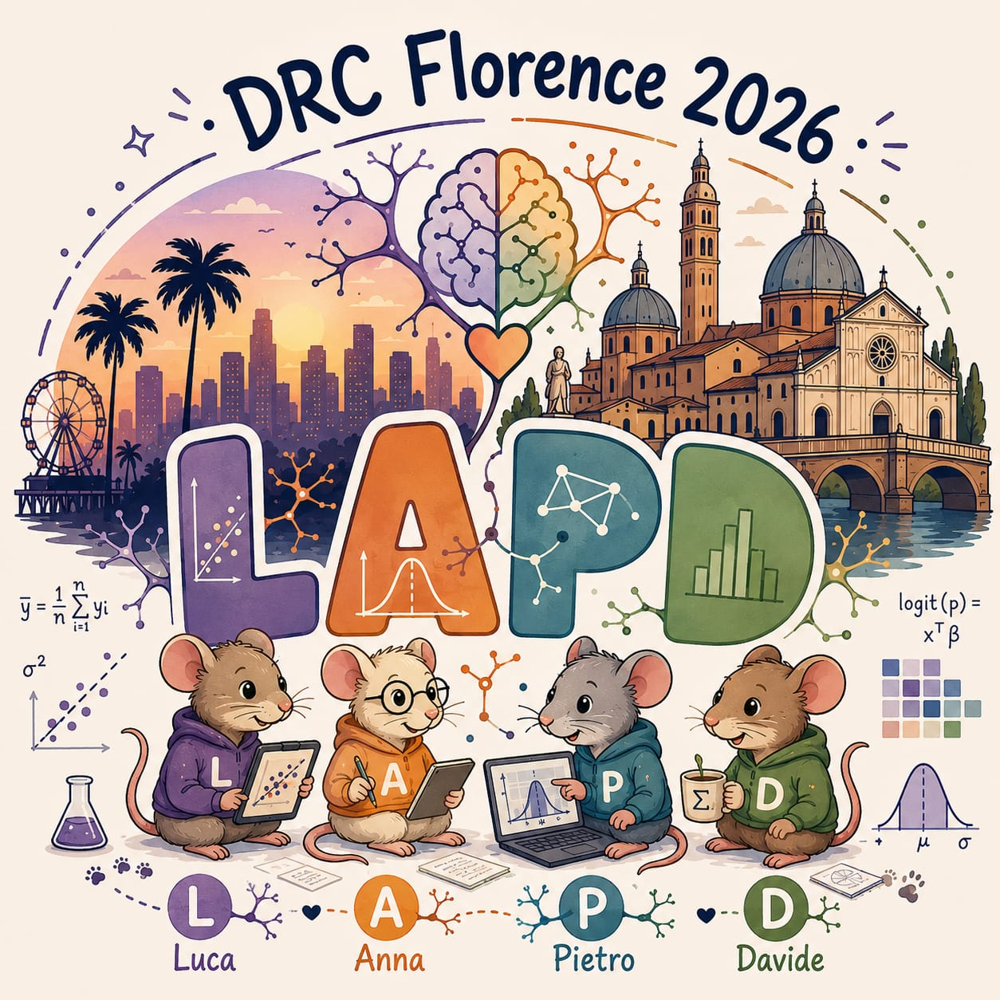

# LAPD

## Data Research Camp 2026
**Group members**: Luca Caldera, Anna Petranzan, Pietro Del Duca, Davide Benussi, Davide Risso

Useful files: 

- [Experiment description](experiment.md)
- [EDA/anna_davide_heatmaps.R](EDA/anna_davide_heatmaps.R): first explorations of nueronal firing patterns.
- [EDA/spatial_occupancy_kde.R](EDA/spatial_occupancy_kde.R): spatial occupancy of mice across trials.
- [script](script): folder with useful functions.
- [analysis](analysis): folder with analysis workflows.

## Recap of work done

### Day 1

- Exploratory data analysis

### Day 2

- Explore possibility of modeling data with a Hurdle model.
- Autologistic regression model for one mouse, one task.
- Exploration of model results.

